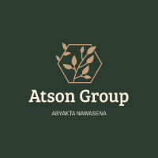
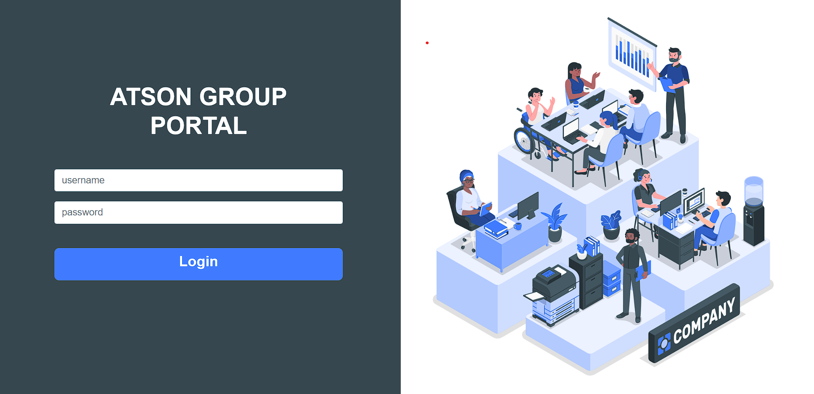
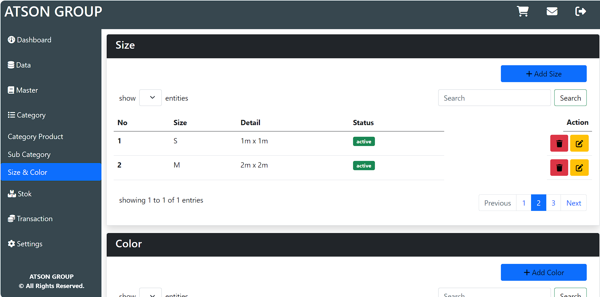
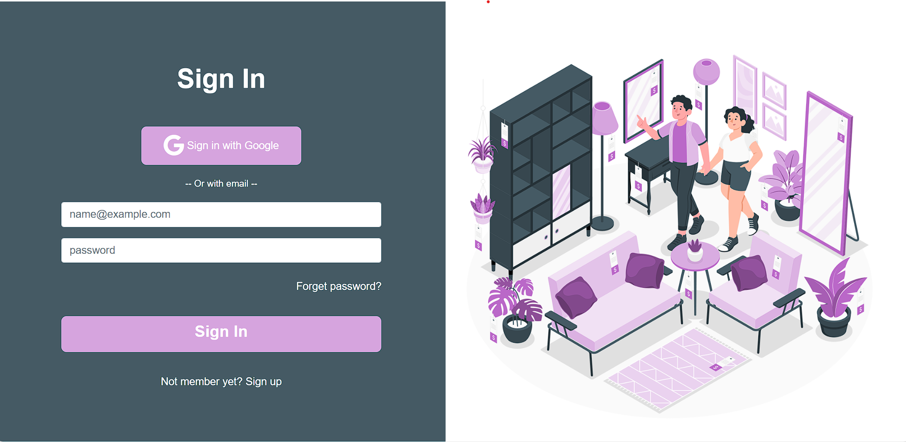
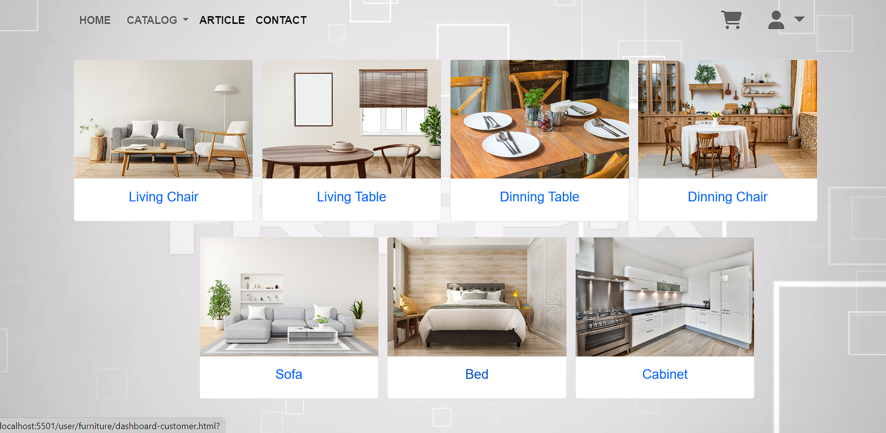
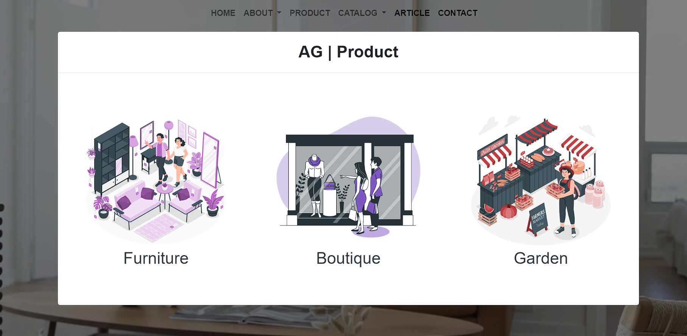
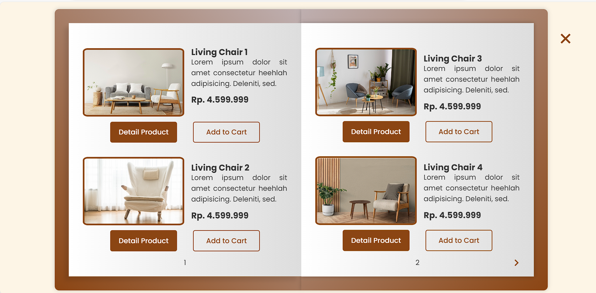

# Atson Group Website



## Deskripsi Proyek

Ini adalah proyek untuk tugas mata kuliah Workshop Desain UI. Website ini didesain untuk Atson Group, sebuah perusahaan yang bergerak di bidang furniture, fashion, dan farming garden. Proyek ini menggunakan HTML, CSS, JavaScript, Bootstrap 5, Font Awesome, dan Box Icon.

## Mockup

Berikut beberapa gambar mockup dari proyek ini:

1. Login Admin

   

2. Dashboard Admin

   

3. Login Customer

   

4. Dashboard Customer

   

5. Landing Page

   

6. Catalog Product

   

## Penulis

Proyek ini dikembangkan oleh alanprayogo.

## Cara Menjalankan Proyek

1. Clone repositori ini ke dalam komputer Anda.
   ```bash
   git clone https://github.com/alanprayogo/atson-group
   ```
